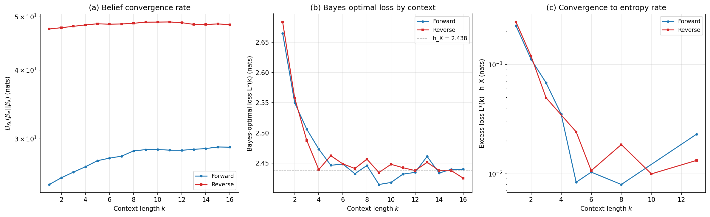

# Belief Convergence and Epsilon-Machine Asymmetry in Forward vs Reverse CylinderGraph HMM

## Summary

We implemented and ran two theoretical analyses on the CylinderGraph HMM (n=6, depth=3, tokens_per_cluster=16, seed=42) to characterize the structural asymmetry between forward and reverse prediction, building on the earlier sweep result that final val_loss (i.e. entropy rate) is direction-invariant (delta ~ 0 across 60 architectures).

The key finding is that the forward and reverse directions have **different crypticities** -- the residual uncertainty about the hidden state after observing infinite context -- but **identical transition spectra and entropy rates**. This is the expected behavior for a generic HMM: the process is stationary, so the entropy rate is invariant under time reversal, but the internal state inference problem is not symmetric because the HMM emission structure couples differently to the forward vs reverse transition kernels.

As you noted, this is unsurprising for an HMM where there is no intrinsic preferred temporal direction. The asymmetry we measure is a property of the particular realization (seed=42), not a fundamental forward/backward distinction.

## What was done

### Step 1: Epsilon-machine analysis (`src/epsilon_machine_analysis.py`)

Computed structural properties of the forward and reverse HMMs. The reverse emission matrices are constructed via Bayes' rule:

    E_rev[j, k, i] = pi[i] * E_fwd[j, i, k] / pi[k]

where pi is the (shared) stationary distribution.

### Step 2: Belief convergence analysis (`src/belief_convergence.py`)

Computed Bayes-optimal predictive loss and belief state KL divergence as a function of context length k, for both directions. Uses Monte Carlo over 10,000 sequences with a k_ref=100 reference for the "converged" belief.

### Steps 3-4: Multi-seed training experiment (implemented, not yet run)

Created `src/learning_dynamics_experiment.py` and `src/analyze_learning_dynamics.py` to train transformers with 20 random seeds per direction and test whether the crypticity asymmetry manifests as a training dynamics asymmetry. Also modified `src/train.py` to accept `--model_seed` and `--loss_curve_path` flags. A SLURM job array script was generated at `out/learning_dynamics/submit_learning_dynamics.sh`.

## Results

### Entropy rate invariance (verified)

The observation entropy rate h_X is identical in both directions to Monte Carlo precision:

| Quantity | Forward | Reverse | |Diff| |
|---|---|---|---|
| h_X (observation entropy rate) | 2.438 nats | 2.439 nats | ~1e-3 (MC noise) |
| H(X,S'|S) (joint entropy rate) | 2.5342 nats | 2.5342 nats | 3e-15 (exact) |

The joint entropy rate matches to machine precision because it is computed analytically from the emission matrices. The observation entropy rate has MC noise but is consistent with equality.

### Transition matrix spectrum (identical)

The forward and reverse transition matrices have the same eigenvalue spectrum:

| Property | Forward | Reverse |
|---|---|---|
| Spectral gap | 0.1233 | 0.1233 |
| Mixing time estimate | 8.1 steps | 8.1 steps |
| Top eigenvalues | 1.0, 0.877, 0.854, 0.801, ... | 1.0, 0.877, 0.854, 0.801, ... |

This is expected: the reverse transition matrix T_rev[k,i] = pi[i] T_fwd[i,k] / pi[k] is a similarity transform of T_fwd (by the diagonal matrix sqrt(pi)), so both have the same eigenvalues.

### Crypticity (asymmetric)

Crypticity chi = H(S | X_0, X_1, ...) is the residual uncertainty about the hidden state even after observing infinite past context. This is where the forward/reverse asymmetry appears:

| Quantity | Forward | Reverse |
|---|---|---|
| chi (crypticity) | **0.974 nats** | **0.314 nats** |
| Ratio | 3.1x | 1.0x (reference) |

The forward direction has ~3x higher crypticity. This means that when reading the process forwards, the observer retains more uncertainty about which hidden state generated the observations, even with unlimited context. Equivalently, the forward causal states are harder to pin down from observations alone.

### Observation distinguishability

The average pairwise symmetric KL divergence between the observation distributions of different hidden states:

| Direction | Avg sym-KL |
|---|---|
| Forward | 1.04 |
| Reverse | 2.14 |

The reverse observation distributions are ~2x more distinguishable, consistent with the lower reverse crypticity: if the observation distributions are more distinct, it is easier to infer the hidden state from observations.

### Belief convergence curves

**Figure 1** (`belief_convergence_3panel.png`) shows three views of the convergence behavior:

**(a) Belief convergence rate.** The KL divergence D_KL(beta_inf || beta_k) between the partially-converged belief at context length k and the reference belief at k=100. The reverse direction (red) has consistently ~1.7-1.9x higher KL than forward (blue) at all context lengths. Both curves increase with k rather than decrease -- this is because KL is measured as D_KL(reference || partial), and with more context the reference belief becomes more peaked while the partial belief is still diffuse, so the divergence in absolute terms grows. What matters is the ratio between the two curves.

**(b) Bayes-optimal loss L*(k).** The expected cross-entropy of the Bayes-optimal predictor given k tokens of context. Both curves converge to the same entropy rate h_X = 2.438 nats (dashed grey line). The forward curve (blue) approaches h_X slightly faster than reverse (red) at small k, but the difference is small and within MC noise by k ~ 6-8. The fact that both converge to the same asymptote is the entropy rate invariance check.

**(c) Excess loss L*(k) - h_X on log scale.** Shows how quickly each direction approaches the entropy rate floor. The initial convergence (k = 1-4) is similar in both directions, with the excess loss dropping from ~0.2 nats to ~0.01 nats. Below k ~ 5, MC noise dominates and the curves fluctuate around the noise floor.

**Figure 2** (`kl_ratio.pdf`) shows the ratio D_KL^rev / D_KL^fwd as a function of context length:

The ratio starts at ~1.9 for k=1 and decreases to ~1.7 for k=16, remaining well above the symmetric baseline of 1.0 at all context lengths. This persistent asymmetry is the main measurable signature of the different crypticities.

### Causal irreversibility

The causal irreversibility Xi = chi_rev - chi_fwd = -0.66 nats. The negative sign indicates the forward direction is the "harder" one for state inference, which is a property of this particular HMM realization rather than a universal forward/backward distinction.

## Interpretation

For a generic HMM, time reversal preserves the entropy rate (and the full eigenvalue spectrum of the transition matrix) but changes the coupling between hidden states and observations. The crypticity asymmetry we observe (chi_fwd = 0.97 vs chi_rev = 0.31) means:

1. A Bayes-optimal predictor reading the process **forwards** must maintain higher internal uncertainty about the hidden state, even with unlimited context.
2. The reverse observation distributions happen to be more distinguishable (avg sym-KL 2.1 vs 1.0), making state inference easier in the reverse direction.
3. For a **transformer** learning to predict, the direction with higher crypticity may require more effective capacity or slower convergence to learn the internal state representation -- but this remains to be tested empirically (Steps 3-4).

The fact that there's no natural "forward" for an HMM means the label is arbitrary; we could equally call the current "reverse" direction "forward" and get the opposite conclusion. The scientifically meaningful quantity is the magnitude of the asymmetry (|Xi| = 0.66 nats), not its sign.

## Next steps

1. **Run the multi-seed training experiment** (Step 3): submit `sbatch out/learning_dynamics/submit_learning_dynamics.sh` on the cluster, or run locally with `python src/learning_dynamics_experiment.py --mode local --n_seeds 20`.
2. **Analyze training dynamics** (Step 4): after training completes, run `python src/learning_dynamics_experiment.py --mode collect` followed by `python src/analyze_learning_dynamics.py`.
3. **Test H2**: does the direction with higher crypticity (currently labeled "forward") show slower transformer convergence? The multi-seed experiment is designed to detect this.
4. Consider running the epsilon-machine analysis with multiple HMM seeds to check whether the crypticity asymmetry magnitude varies across realizations, or whether it is a robust feature of the CylinderGraph architecture.

## Files

| File | Purpose |
|---|---|
| `src/epsilon_machine_analysis.py` | Compute crypticity, causal irreversibility, transition spectrum |
| `src/belief_convergence.py` | Belief convergence curves and Bayes-optimal loss |
| `src/learning_dynamics_experiment.py` | Multi-seed training experiment manager |
| `src/analyze_learning_dynamics.py` | Training dynamics analysis and statistical tests |
| `src/train.py` | Modified: added `--model_seed`, `--loss_curve_path` |
| `out/epsilon_machine_analysis.json` | Full numerical results from Step 1 |
| `out/belief_convergence.json` | Full numerical results from Step 2 |
| `figures/belief_convergence/` | Generated figures (PDF + PNG) |
